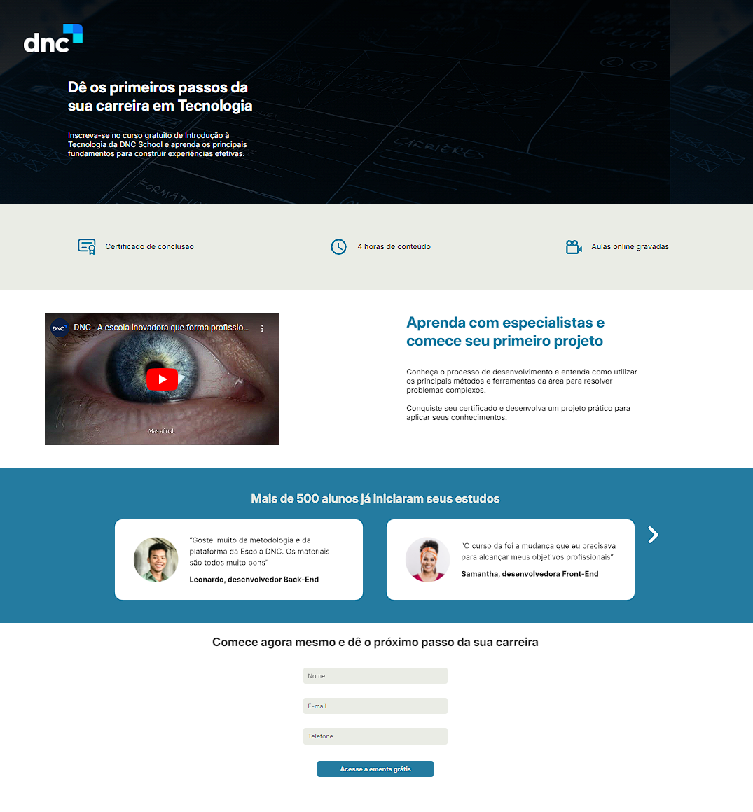

<h1>Landing Page DNC</h1>

<h4>Este projeto visa o desenvolvimento de uma landing page para a captação de leads, onde o visitante da página, ao preencher os campos de contato, recebe a ementa do curso e poderá ser contatado por um representante da escola posteriormente.</h4>

Tecnologias usadas: HTML, CSS e JavaScript.

<strong>Funcionalidade para o usuário:</strong> Ao preencher os campos obrigatórios, o usuário tem acesso à ementa de um curso de tecnologia em formato PDF.

<strong>Funcionalidade para a empresa:</strong> Quando o usuário preenche os campos obrigatórios e tem acesso à ementa do curso, seus dados de contato são armazenados em uma planilha via <a href="https://sheetmonkey.io/pt-br" target="_blank">https://sheetmonkey.io/pt-br</a>.

